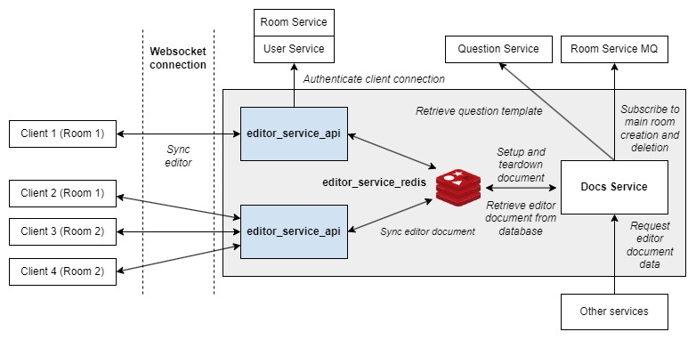

# PeerPrep Editor Service

> Powers the collaborative real-time code editor of PeerPrep

The Editor Service provides the mechanism for real-time collaboration (e.g. concurrent code editing) between the authenticated and matched users in the collaborative space.

- Providing document synchronization that allows users in the same room to edit the same code in real-time.
- Authenticates users based on their access to a given room.

## Table of Contents

- [PeerPrep Editor Service](#peerprep-editor-service)
  - [Table of Contents](#table-of-contents)
  - [Requirements](#requirements)
  - [Quick Start](#quick-start)
  - [Environment Variables](#environment-variables)
  - [Overview](#overview)
    - [editor\_service\_api](#editor_service_api)
    - [editor\_service\_redis](#editor_service_redis)
    - [Docs Service](#docs-service)
  - [Docker Images](#docker-images)
    - [API](#api)
  - [Deployment](#deployment)
    - [Kubernetes Deployment](#kubernetes-deployment)
    - [Docker Compose Deployment](#docker-compose-deployment)
  - [WebSocket Client](#websocket-client)
    - [Authentication](#authentication)

## Requirements

Editor Service requires the following services to operate correctly.

- [User Service](https://github.com/CS3219-AY2324S1-G04/peerprep_user_service) - Provides user authentication
- [Room Service](https://github.com/CS3219-AY2324S1-G04/peerprep_room_service) - Provides user room authentication
- [Docs Service](https://github.com/CS3219-AY2324S1-G04/peerprep_document_service) - Provides document setup / teardown

## Quick Start

1. Clone this repository.
2. Configure the `.env` file (Refer to [Environment Variables](#environment-variables))
3. Install the necessary dependencies `npm install`
4. Build and run the docker container. `docker compose up -d`

## Environment Variables

| Variable Name | Default Value | Description |
| ------------- | ------------- | ----------- |
| EDITOR_SERVICE_PORT | 9004 | The port used to bind the websocket server. |
| EDITOR_SERVICE_ROUTE | '/editor-service' | Endpoint for receiving messages. |
| REDIS_HOST | 'editor_service_redis' | Host for the redis database |
| REDIS_PORT | 6379 | Port for the redis database |
| REDIS_USERNAME | 'default' | Username for redis database authentication |
| REDIS_PASSWORD | 'password' | Password for redis database authentication |
| REDIS_DB | 0 | Database index used for redis database |
| REDIS_DOCKER_PORT | 6384 | Port exposed by docker |

> REDIS_PORT, REDIS_PASSWORD, REDIS_DOCKER_PORT will be used in the specification by Docker Compose to build and run the editor_service_redis container.

## Overview



The above architectural diagram describes the main interactions between the clients, multiple instances of Editor Service, Docs Service and Redis.

### editor_service_api

- Editor Service instance that establishes and authenticates WebSocket connections with clients.
- Synchronizes changes to editor documents between clients.
  - A single document can be shared by multiple clients.
- Supports horizontal scaling using Kubernetes deployment.

### editor_service_redis

- Redis database that serves as a message broker between Editor Service instances, propagating changes between editor documents.
- Supports horizontal scaling using Redis Cluster.

### Docs Service

- A service that handles that provides document setup and teardown based on room creation and deletion events from the Room Service MQ.
- **Setup**: Insertion of question code template.
- **Teardown**: Publishes room deletion message to Editor Service instances through Redis and clears the document data from Redis.
- **Document Retrieval**: Provides a REST API endpoint for other services to retrieve document data.
- Supports horizontal scaling using Kubernetes deployment.
- For more information, refer to [Docs Service](https://github.com/CS3219-AY2324S1-G04/peerprep_document_service).

## Docker Images

### API

**Name**: ghcr.io/cs3219-ay2324s1-g04/peerprep_editor_service_api

**Description**: Runs the Editor Service container.

## Deployment

### Kubernetes Deployment

This is the main deployment method for production.

**Note:**

- The database is hosted externally, not within the Kubernetes cluster.

**Prerequisite**

- Docker images must be pushed to the container registry and made public.
  - To push to the container registry (assuming one has the necessary permissions), run: `./build_images.sh -p`
  - To make the images public, change the visibility of the image on [GitHub](https://github.com/orgs/CS3219-AY2324S1-G04/packages).
- Kubernetes cluster must be setup as specified in the [main repository](https://github.com/CS3219-AY2324S1/ay2324s1-course-assessment-g04#deployment).

**Steps:**

1. Ensure the "peerprep" namespace has been created: `kubectl create namespace peerprep`
2. Navigate to the "kubernetes" directory: `cd kubernetes`
3. Deploy the Kubernetes objects: `./deploy.sh`
    - To delete the Kubernetes objects, run: `./delete.sh`

### Docker Compose Deployment

This is intended for development use only. It is meant to make developing other services easier.

**Note:**

- No horizontal auto scaling is provided.
- The database is created by Docker compose and data is not backed up.

## WebSocket Client

```ts
import { WebsocketProvider } from 'y-websocket'
import * as Y from 'yjs'

const doc = new Y.Doc()
const roomName = 'room'

const wsOpts = {
  params: { roomId },
}

const wsProvider = new WebsocketProvider(
  editorServiceBaseUrl,
  room,
  doc,
  wsOpts,
)
```

- Ensure that `editorServiceBaseUrl` is set to `ws://hostname:9004/editor-service/`
- Ensure that `roomId` is set to the actual roomId.
- This will synchronize the CRDT `doc` to the editor document of `roomId`.
- Refer to [y-websocket](https://github.com/yjs/y-websocket) for further details.

### Authentication

For the client connection to be successfully authenticated by the Editor Service instance:

1. Ensure that the user belongs to the room of `roomId`.
2. Ensure that the user's access token is stored in the HTTP cookie and that the Cookie HTTP header is sent in the WebSocket upgrade request.
